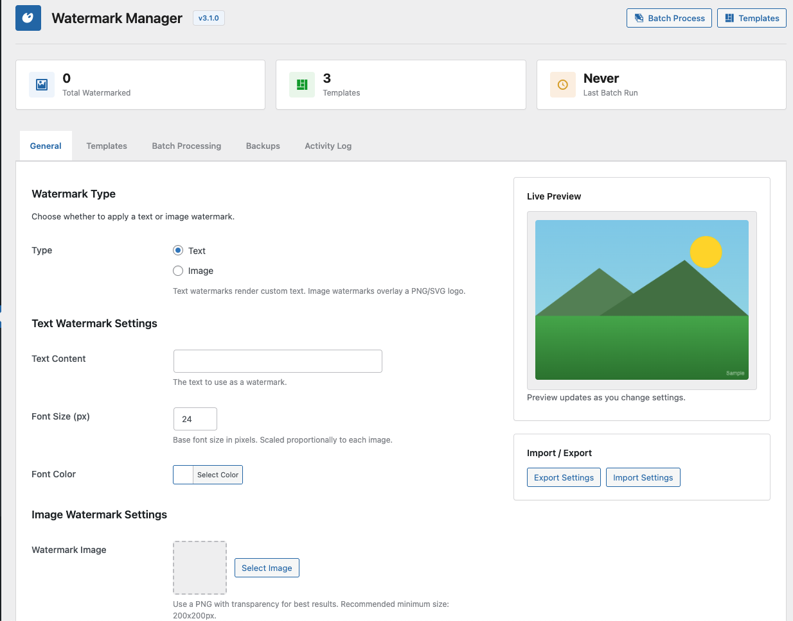
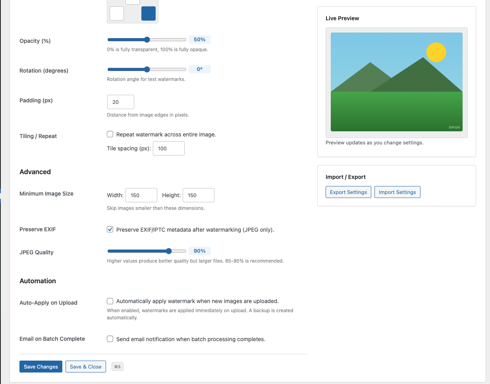
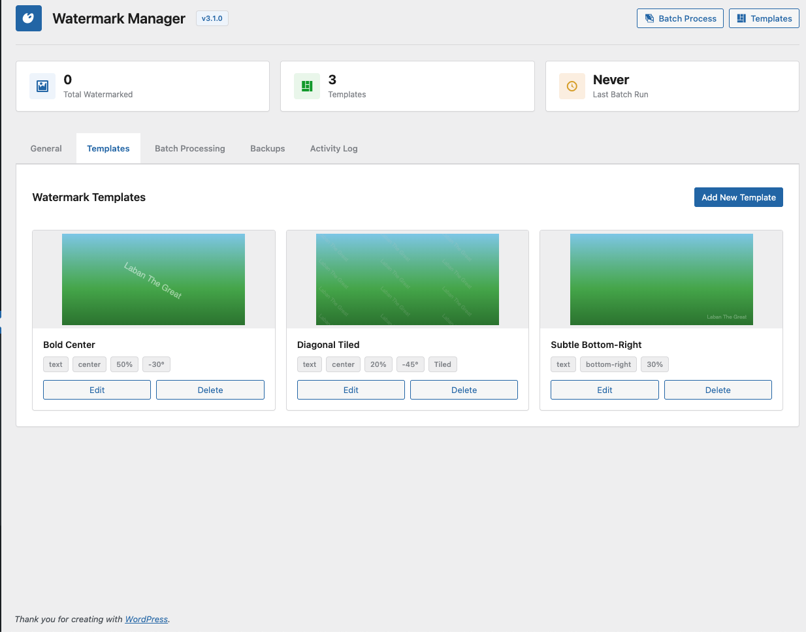
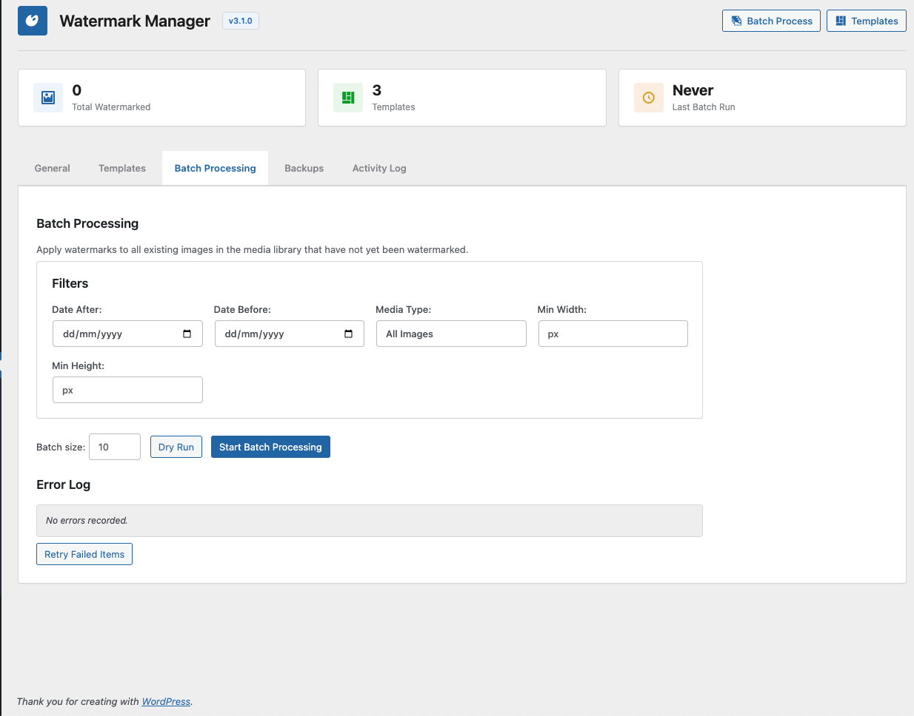

# Watermark Manager

Apply text or image watermarks to WordPress media uploads. Supports batch processing, reusable templates, automatic backup/restore of originals, and WP-CLI.

## Requirements

- WordPress 6.0+
- PHP 8.0+
- GD library (with `imagecreatefrompng`, `imagettftext`, etc.)

## Installation

1. Upload the `watermark-manager` directory to `/wp-content/plugins/`.
2. Activate through **Plugins** in the WordPress admin.
3. Go to **Settings > Watermark Manager** to configure.

On activation the plugin creates three starter templates and a protected backup directory inside `wp-content/uploads/wm-backups/`.

## Features

- **Text watermarks** -- configurable content, font size, colour, and opacity.
- **Image watermarks** -- use any media library image, scaled relative to the target.
- **Positioning** -- top-left, top-right, center, bottom-left, bottom-right, with configurable edge padding.
- **Tiling** -- repeat the watermark across the entire image with adjustable spacing.
- **Rotation** -- arbitrary rotation angle (-360 to 360 degrees) for both text and image watermarks.
- **Auto-apply on upload** -- watermarks new image uploads automatically when the `auto_apply` setting is enabled.
- **Batch processing** -- process all existing unwatermarked images via the admin UI or WP-CLI. Supports date range filtering, minimum dimension filtering, dry-run preview, pause/cancel, and email notification on completion.
- **Templates** -- save and reuse watermark presets (type, position, opacity, scale, rotation, tiling, font settings). Three defaults are created on activation.
- **Backup and restore** -- originals are backed up before watermarking. Restore any image to its pre-watermark state from the admin or CLI. Daily cron cleans up backups older than the configured retention period (default 90 days).
- **Per-image controls** -- apply or remove watermarks on individual attachments from the attachment edit screen or media modal.
- **Import/export** -- export and import plugin settings as JSON.
- **Activity log** -- tracks watermark applications, backups, restores, and batch operations.
- **Supported formats** -- JPEG, PNG, GIF, WebP. Optional WebP output conversion with configurable quality.
- **EXIF preservation** -- JPEG EXIF/IPTC metadata is preserved through watermarking (when `preserve_exif` is enabled).
- **Minimum size threshold** -- skip images below a configurable width/height.

## Settings

Configure under **Settings > Watermark Manager**. The settings page has tabs for general settings, templates, backups, and the activity log.

Key options stored in `wm_settings`:

| Option | Type | Default | Description |
|---|---|---|---|
| `watermark_type` | string | `text` | `text` or `image` |
| `text_content` | string | Site name | Text to render |
| `font_size` | int | `24` | Base font size (scaled relative to image width) |
| `font_color` | string | `#ffffff` | Hex colour |
| `watermark_image` | int | `0` | Attachment ID of watermark image |
| `position` | string | `bottom-right` | Placement on the image |
| `opacity` | int | `50` | 0 (transparent) to 100 (opaque) |
| `scale` | int | `25` | Watermark image width as percentage of target |
| `rotation` | int | `0` | Degrees of rotation |
| `padding` | int | `20` | Edge padding in pixels |
| `tiling` | bool | `false` | Repeat watermark across entire image |
| `tile_spacing` | int | `100` | Pixel gap between tiled repetitions |
| `auto_apply` | bool | `false` | Auto-watermark on upload |
| `min_width` | int | `150` | Skip images narrower than this |
| `min_height` | int | `150` | Skip images shorter than this |
| `preserve_exif` | bool | `true` | Keep JPEG EXIF data |
| `webp_output` | bool | `false` | Convert output to WebP |
| `webp_quality` | int | `85` | WebP output quality |
| `jpeg_quality` | int | `90` | JPEG output quality |

Backup settings are stored separately in `wm_backup_settings`:

| Option | Type | Default | Description |
|---|---|---|---|
| `auto_cleanup` | bool | `true` | Enable daily cleanup cron |
| `cleanup_days` | int | `90` | Delete backups older than N days |
| `max_disk_mb` | int | `1024` | Disk budget for backups (MB) |
| `warn_threshold` | int | `80` | Disk usage warning percentage |

## WP-CLI Commands

All commands are registered under the `wp watermark` namespace.

### Apply watermark to a single image

```
wp watermark apply <attachment_id> [--template=<id>] [--force]
```

- `--template=<id>` -- use a specific template's settings instead of the global config.
- `--force` -- re-apply even if the image is already watermarked.

```
wp watermark apply 42
wp watermark apply 42 --template=5
wp watermark apply 42 --force
```

### Batch process all unwatermarked images

```
wp watermark batch [--batch-size=<n>] [--template=<id>] [--dry-run] [--date-after=<YYYY-MM-DD>] [--date-before=<YYYY-MM-DD>] [--min-width=<px>] [--min-height=<px>]
```

- `--batch-size=<n>` -- images per iteration (default 50, max 200).
- `--dry-run` -- list what would be processed without applying anything.
- `--date-after` / `--date-before` -- filter by upload date.
- `--min-width` / `--min-height` -- skip images below these dimensions.

```
wp watermark batch
wp watermark batch --batch-size=100
wp watermark batch --dry-run
wp watermark batch --date-after=2025-01-01 --template=3
```

### Remove watermark (restore from backup)

```
wp watermark remove <attachment_id>
```

```
wp watermark remove 42
```

### Show watermark statistics

```
wp watermark status [--format=<table|json|csv|yaml>]
```

Reports total images, watermarked/unwatermarked/failed/skipped counts, backup count, backup disk usage.

```
wp watermark status
wp watermark status --format=json
```

### List templates

```
wp watermark templates [--format=<table|json|csv|yaml>]
```

```
wp watermark templates
wp watermark templates --format=json
```

## Hooks and Filters

### Filters

**`wm_font_path`**

Override the TTF font used for text watermarks. By default the plugin searches common system font paths.

```php
add_filter( 'wm_font_path', function () {
    return get_stylesheet_directory() . '/fonts/custom-font.ttf';
} );
```

### Actions

**`wm_daily_backup_cleanup`**

Cron action that runs the automatic backup cleanup. Fires daily. You can trigger it manually:

```php
do_action( 'wm_daily_backup_cleanup' );
```

### WordPress Filters Used

**`wp_generate_attachment_metadata`**

When `auto_apply` is enabled, the plugin hooks into this filter at priority 10 to watermark images immediately after upload and thumbnail generation.

**`attachment_fields_to_edit`**

Adds a read-only watermark status field to the media modal.

**`plugin_action_links_{plugin}`**

Adds a "Settings" link on the Plugins page.

## Post Meta Reference

| Meta Key | Description |
|---|---|
| `_wm_watermarked` | Timestamp when watermark was applied, or `skipped`/`failed` |
| `_wm_original_backup` | Absolute path to the backup file |
| `_wm_backup_date` | Timestamp when backup was created |
| `_wm_backup_size` | Backup file size in bytes |

## Development

```bash
git clone https://github.com/labannjoroge/watermark-manager.git
cd watermark-manager
composer install
```

Follows WordPress coding standards. Run `composer phpcs` to check.

## Screenshots


*General settings with watermark type, text/image options, live preview, and import/export*


*Advanced settings with opacity, rotation, tiling, EXIF preservation, and automation options*


*Template management with saved presets showing watermark previews*


*Batch processing with date range filters, dimension filters, dry run, and error log*

## Changelog

### 3.1.0

- Batch query refactoring for CLI and admin.
- Memory-safe batch processing with runtime cache flushing.
- Dimension filtering in batch operations.
- Capped error log and batch sizes.
- Centralized AJAX handler.

### 3.0.0

- WP-CLI commands: `apply`, `batch`, `remove`, `status`, `templates`.
- EXIF/IPTC metadata preservation for JPEG files.
- Batch dry-run mode, retry failed items, error log.
- Manual backup cleanup, paginated backup list.
- Import/export settings.
- Email notification on batch completion.

### 2.0.0

- Watermark template system (custom post type).
- Image watermark support (in addition to text).
- Tiling mode for both text and image watermarks.
- Image backup and restore system with daily cron cleanup.
- Activity log.

### 1.0.0

- Initial release.
- Text watermarks with position, opacity, and scale controls.
- Auto-apply on upload.
- Batch processing via admin UI.
- Per-attachment watermark controls on the edit screen.

## Author

**Laban The Great**
- Email: hello@labanthegreat.com
- Web: [labanthegreat.com](https://labanthegreat.com)
- GitHub: [github.com/labannjoroge](https://github.com/labannjoroge)

## License

GPL-2.0-or-later
